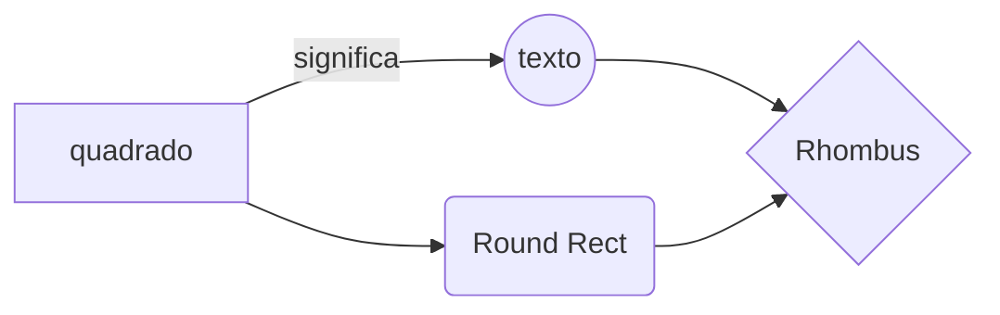

> Isso é um teste de diagramas e imagens
{: .prompt-tip }

esse tipo de diagrama não funciona!!

# Imagem
Abaixo, uma imagem importantíssima:

### Hmm
Pelo que parece a sintaxe não é exatamente igual a do obsidian.

{: width="972" height="589" .w-50 .left}
Bom, então a partir disos é possível fazer reviews e zas e zas
> dito isso é hora de dormir 00:43. \\
> imagens deram problema 
As imagens estão dando problema