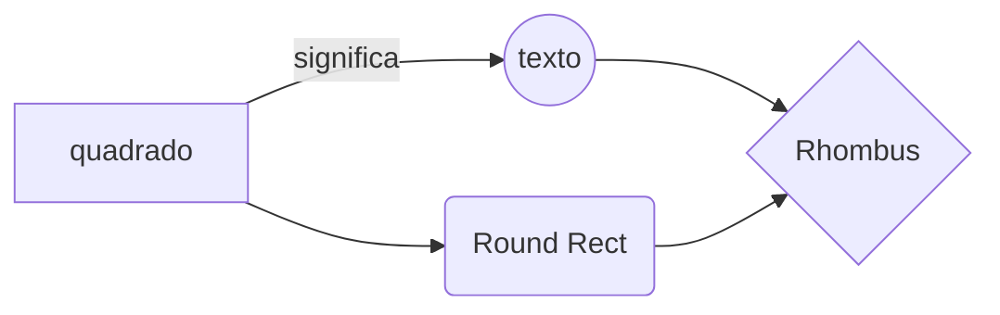

> Isso é um teste de diagramas e imagens
{: .prompt-tip }

esse tipo de diagrama não funciona!!

# Imagem
Abaixo, uma imagem importantíssima:

### Hmm
Pelo que parece a sintaxe não é exatamente igual a do obsidian.

{: width="972" height="589" .w-50 .left}
Bom, então a partir disos é possível fazer reviews e zas e zas
> dito isso é hora de dormir 00:43. \\
> imagens deram problema \\
>As imagens estão dando problema, provavelmente culpa do caminho ou da barra invertida!!

Pra mudar o nome das abas laterais aqui na esquerda, eu adicionei um arquivo na pasta locales com o nome pt-BRA, que é diferente do nome padrão do português brasileiro pt-BR, daí colocando a língua como pt-BRA no config.yml, eu posso alterar todo o texto do site a partir do arquivo que eu fiz, nesse caso copiei tudo do yml original pt-BR e editei o que eu queria, por exemplo, coloquei a página HOME como INÍCIO. \\
adiburai naxumerus abadinome adiburai naxumerus abadinome adiburai naxumerus abadinome adiburai naxumerus abadinome adiburai naxumerus abadinome 
adiburai naxumerus abadinome adiburai naxumerus abadinome adiburai naxumerus abadinome adiburai naxumerus abadinome adiburai naxumerus abadinome 
adiburai naxumerus abadinome adiburai naxumerus abadinome adiburai naxumerus abadinome adiburai naxumerus abadinome adiburai naxumerus abadinome 
adiburai naxumerus abadinome adiburai naxumerus abadinome adiburai naxumerus abadinome adiburai naxumerus abadinome adiburai naxumerus abadinome 
adiburai naxumerus abadinome adiburai naxumerus abadinome adiburai naxumerus abadinome adiburai naxumerus abadinome adiburai naxumerus abadinome 
adiburai naxumerus abadinome adiburai naxumerus abadinome adiburai naxumerus abadinome adiburai naxumerus abadinome adiburai naxumerus abadinome 
adiburai naxumerus abadinome adiburai naxumerus abadinome adiburai naxumerus abadinome adiburai naxumerus abadinome adiburai naxumerus abadinome 
adiburai naxumerus abadinome adiburai naxumerus abadinome adiburai naxumerus abadinome adiburai naxumerus abadinome adiburai naxumerus abadinome        
> Não usar o caminho copiado do windows, e sim com essa barra aqui / 
{: .prompt-tip }