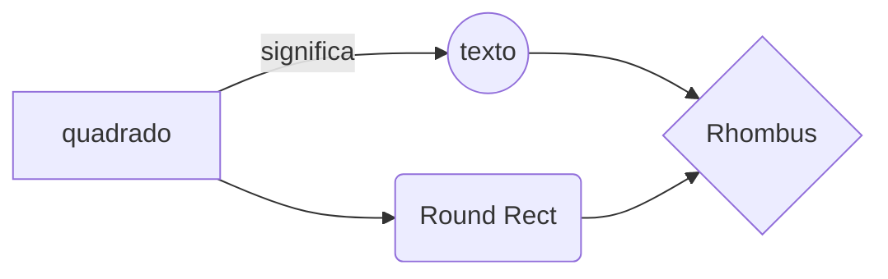

> Isso é um teste de diagramas e imagens
{: .prompt-tip }


``` mermaid
graph LR
A[quadrado] -- significa --> B((texto))
A --> C(Round Rect)
B --> D{Rhombus}
C --> D

```
esse tipo de diagrama não funciona!!

# Imagem
Abaixo, uma imagem importantíssima:


### Hmm
Pelo que parece a sintaxe não é exatamente igual a do obsidian.

{: width="972" height="589" .w-50 .left}
Bom, então a partir disos é possível fazer reviews e zas e zas
> dito isso é hora de dormir 00:43. \\
> imagens deram problema \\
>As imagens estão dando problema, provavelmente culpa do caminho ou da barra invertida!!

Pra mudar o nome das abas laterais aqui na esquerda, eu adicionei um arquivo na pasta locales com o nome pt-BRA, que é diferente do nome padrão do português brasileiro pt-BR, daí colocando a língua como pt-BRA no config.yml, eu posso alterar todo o texto do site a partir do arquivo que eu fiz, nesse caso copiei tudo do yml original pt-BR e editei o que eu queria, por exemplo, coloquei a página HOME como INÍCIO. \\
teste de icone  <i class="fa fa-bomb"></i>

---
## Dia 23/06/2026

---

Ao invés de fazer relatórios e estudar para as provas, o divertido foi fazer coisas loucas aqui nesse site. Em especial, conseguir colocar ele pra rodar no Thinkpad, e pra isso foi feito o seguinte:
- Comecei seguindo a instalação do ruby e do [Jekyll](https://jekyllrb.com/docs/installation/ubuntu/), e foi bem tranquilo sem estresse. O que deu um certo trabalho foi logar no github:

```sh
sudo pacman -S github-cli
```
Além disso, uns erros aconteceram ao rodar o comando bundle pois haviam erros ao instalar as coisas a partir desse comando:

```sh
gem install jekyll bundler
```

A solução, foi simplesmente adicionar o PATH no ~/.bashrc, a partir das seguintes linhas:

```sh
export GEM_HOME=$HOME/gems
export PATH=$HOME/gems/bin:$PATH
```

No mais, os seguintes comandos são usados:

### Iniciar site local:
```sh
bundle exec jekyll main
```
#### Colocar no github:
```sh
 git add .
 git commit -m 'comentário'
 git push origin main

```